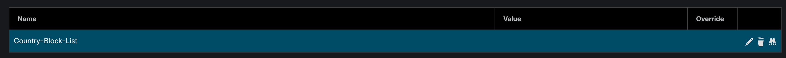

# GVE DevNet FMC Generate ACL from Block List

This script creates an FMC Network Group object from a Country IP Block List obtained from [countryipblocks.net](https://www.countryipblocks.net/acl.php). The Network Group object is then used to create an extended ACL.

## Contacts
* Trevor Maco

## Solution Components
* FMC
* Python 3.11

## Prerequisites
1. Ensure you have the FQDN or IP of the FMC instance, and a username/password for an admin user. **Note**: these values will be added to a config file.
2. Download a Country IP Block List from `countryipblocks.net`:
   1. Select a Country
   2. Select `Network-Object` as the format. **Note**: data format is important, the code may not work with other formats!
   3. Select `Create ACL`, copy ACL contents to clipboard, create a new text file in the code's home directory, and paste the contents. **Note**: The file can be named anything (for example: `ipblocks.txt`)

## Installation/Configuration
1. Clone this repository with `git clone https://github.com/gve-sw/gve_devnet_fmc_generate_acl`
2. Add the IP address, username, and password that you collected in the Prerequisites section to `config.py` file.
```python
HOSTNAME = "<ip or FQDN>"
USERNAME = "<username>"
PASSWORD = "<password>"
```
3. Set up a Python virtual environment. Make sure Python 3 is installed in your environment, and if not, you may download Python [here](https://www.python.org/downloads/). Once Python 3 is installed in your environment, you can activate the virtual environment with the instructions found [here](https://docs.python.org/3/tutorial/venv.html).
4. Install the requirements with `pip3 install -r requirements.txt`


## Usage
To run the code, use the command:
```
$ python3 main.py
```

This command will prompt for a file name (provide the block list file name from the prerequisites section) and the country name:


* **Note**: Country Name is for the naming convention used when creating FMC Network Objects and the Extended ACL list. The same name will overwrite previously created objects (simulating an 'update')

with script output:


Check the FMC's Object Management Interface to see the created objects.

Network Objects:


* **Note:** Only 1000 literal IP's can exist in a network group, so several subgroups may be created depending on length of country IP block list. A conglomerate group is also created and used in ACL creation when applicable.

Extended ACL:



# Screenshots


### LICENSE

Provided under Cisco Sample Code License, for details see [LICENSE](LICENSE.md)

### CODE_OF_CONDUCT

Our code of conduct is available [here](CODE_OF_CONDUCT.md)

### CONTRIBUTING

See our contributing guidelines [here](CONTRIBUTING.md)

#### DISCLAIMER:
<b>Please note:</b> This script is meant for demo purposes only. All tools/ scripts in this repo are released for use "AS IS" without any warranties of any kind, including, but not limited to their installation, use, or performance. Any use of these scripts and tools is at your own risk. There is no guarantee that they have been through thorough testing in a comparable environment and we are not responsible for any damage or data loss incurred with their use.
You are responsible for reviewing and testing any scripts you run thoroughly before use in any non-testing environment.